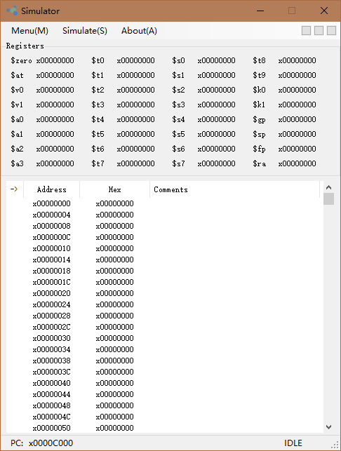
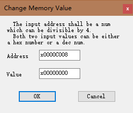
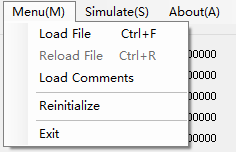
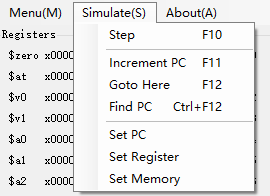
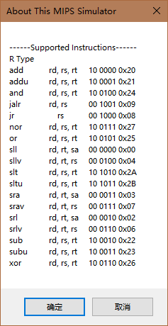
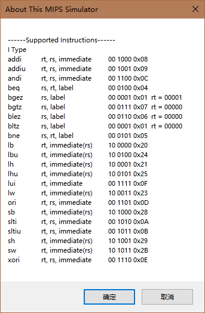
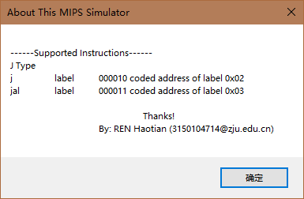
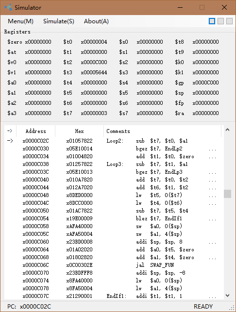

# MIPS-Simulator
A simulator for a subset of MIPS. (**uses MIPS binary file generated by [MIPS-Assembler](https://github.com/EveryTian/MIPS-Assembler).**)

### Main User Interface

### Menu Items

### Supported Instructions

### Running Pre

